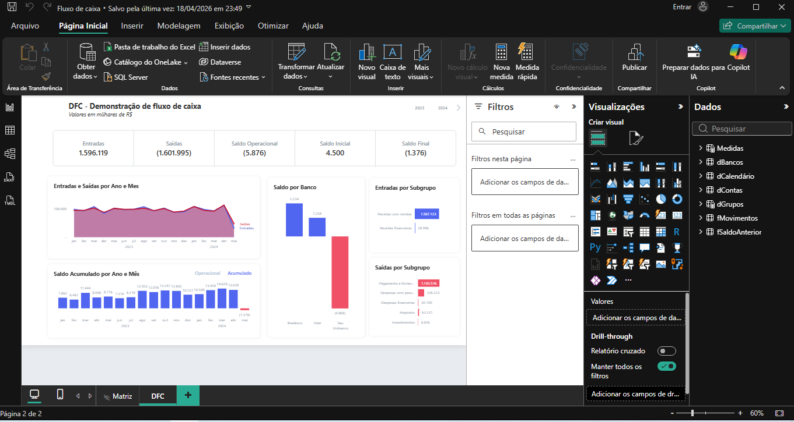

# 💰 Operacional Financeiro | Operational Finance (Fluxo de Caixa)

[PT] Desenvolvimento de um ecossistema de Business Intelligence para gestão de fluxo de caixa, permitindo análise de liquidez e saúde financeira em tempo real.
[EN] Business Intelligence ecosystem for cash flow management, enabling real-time liquidity and financial health analysis.

---

## 📊 Dashboard - Visão Geral | Overview

---

## 🏗️ Modelagem de Dados | Data Modeling (Star Schema)
[PT] Estruturação técnica utilizando o padrão Star Schema, garantindo performance em grandes volumes de dados e integridade nos cálculos de DAX.
[EN] Technical structuring using the Star Schema pattern, ensuring performance across large data volumes and integrity in DAX calculations.

---

## 📑 Plano de Contas | Chart of Accounts
[PT] Organização hierárquica das contas para permitir auditorias detalhadas e categorização precisa de entradas e saídas.
[EN] Hierarchical account organization to enable detailed audits and precise categorization of inflows and outflows.

---

## 🛠️ Destaques Técnicos | Technical Highlights
* **DAX Avançado:** Inteligência de tempo para saldos acumulados e variações mensais.
* **Power Query (M):** Transformação de dados com foco em precisão financeira (Fixed Decimal Number).
* **Arquivos:** [Aceder ao ficheiro .pbix](./Fluxo%20de%20caixa.pbix)
